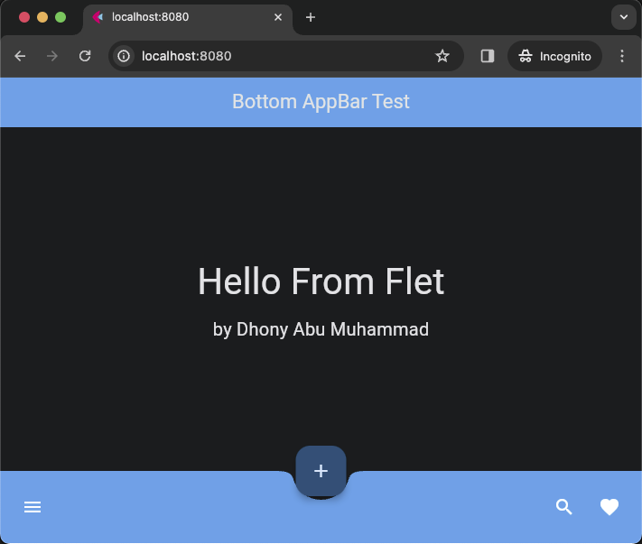

# Flet app more knowledge

### &#x1F530; Begin Project :

    ❯ pwd

        /Users/.../python-flet-app-more-knowledge

    ❯ python -m venv venv

    ❯ source ./venv/bin/activate

    ❯ pip install flet

    ❯ cd <project-name>

### &#x1FAB6; Code :

    import flet as ft

    def main(page: ft.Page):
        page.horizontal_alignment = page.vertical_alignment = "center"

        page.floating_action_button = ft.FloatingActionButton(icon=ft.icons.ADD)
        page.floating_action_button_location = ft.FloatingActionButtonLocation.CENTER_DOCKED

        page.appbar = ft.AppBar(
            title=ft.Text("Bottom AppBar Test"),
            center_title=True,
            bgcolor=ft.colors.BLUE,
            automatically_imply_leading=False,
        )
        page.bottom_appbar = ft.BottomAppBar(
            bgcolor=ft.colors.BLUE,
            shape=ft.NotchShape.CIRCULAR,
            content=ft.Row(
                controls=[
                    ft.IconButton(icon=ft.icons.MENU, icon_color=ft.colors.WHITE),
                    ft.Container(expand=True),
                    ft.IconButton(icon=ft.icons.SEARCH, icon_color=ft.colors.WHITE),
                    ft.IconButton(icon=ft.icons.FAVORITE, icon_color=ft.colors.WHITE),
                ]
            ),
        )

        content_1 = ft.Container(
            content = ft.Column([
                ft.Text("Hello From Flet", size=40)
            ])
        )

        content_2 = ft.Container(
            content = ft.Column([
                ft.Text("by Dhony Abu Muhammad", size=20)
            ])
        )

        page.add(content_1, content_2)

    ft.app(target=main, port=8888)

### &#x1F3C3; Run :

command for deploy desktop app

    ❯ flet main.py -d 

command for deploy web

    ❯ flet main.py -w

    

### &#x1F3C5; Result :

    

desktop apps

---

    

web

---

## &#x1F3C6; Application deployment with Docker container

    ❯ docker build -t flet-testapp .

    ❯ docker run -d --name flet-testapp-svc -p 8080:8888 flet-testapp

    # list
    ❯ docker run -d --name flet-testapp-svc -p 8080:8888 flet-testapp

        243e5aedfeab4e7d93e4943dda88c3d2f111dc19d43b361171d0be553f451b63

    ❯ docker ps -a

        CONTAINER ID   IMAGE          COMMAND              CREATED         STATUS         PORTS                    NAMES
        243e5aedfeab   flet-testapp   "python ./main.py"   3 seconds ago   Up 2 seconds   0.0.0.0:8080->8888/tcp   flet-testapp-svc    

    

web

Clear all images and containers

    ❯ docker rm -f $(docker ps -aq) && docker rmi -f $(docker images -q)

        243e5aedfeab
        Untagged: flet-testapp:latest
        Deleted: sha256:70e0234046d232312d86c10ba0c89971d7bd9e9fba7ef2090bf97fba940afbb7

---

### &#x1FAA7; Notes :

    ❯ flet --version

        0.21.1
