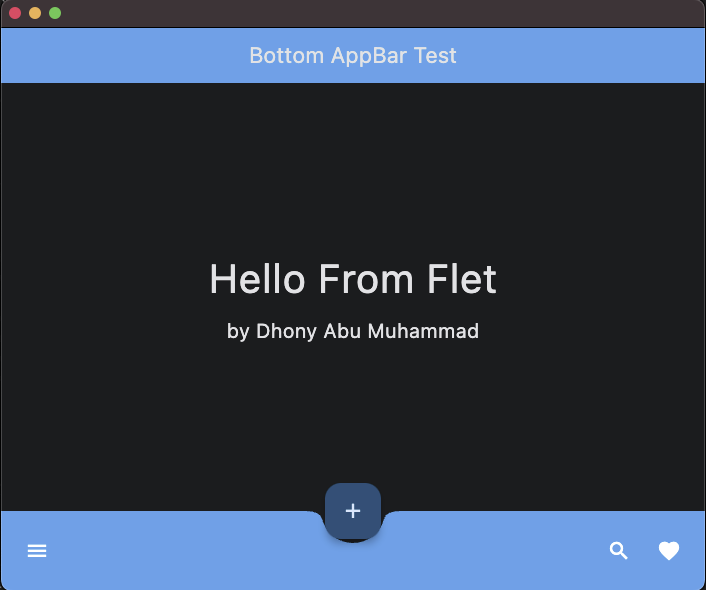
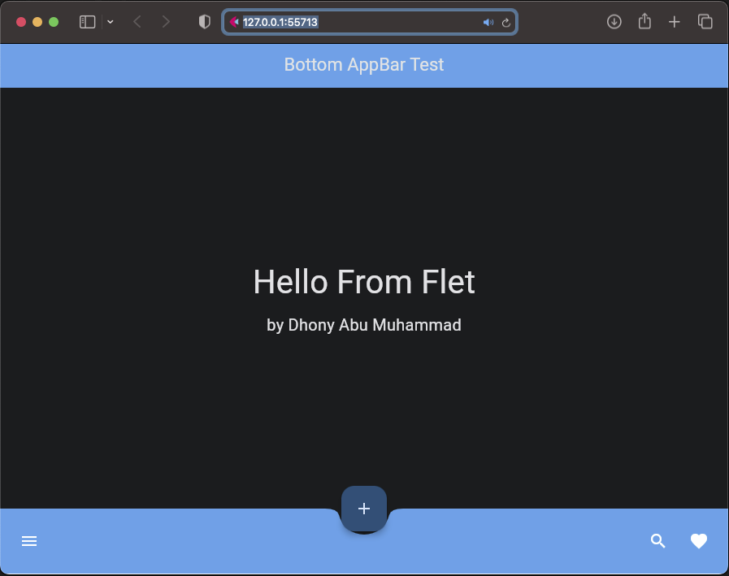

# Flet app more knowledge

### Begin Project :

    ❯ pwd

        /Users/.../python-flet-app-more-knowledge

    ❯ python -m venv venv

    ❯ source ./venv/bin/activate

    ❯ pip install flet

    ❯ cd <project-name>

### &#x1FAB6; Code :

    import flet as ft

    def main(page: ft.Page):
        page.horizontal_alignment = page.vertical_alignment = "center"

        page.floating_action_button = ft.FloatingActionButton(icon=ft.icons.ADD)
        page.floating_action_button_location = ft.FloatingActionButtonLocation.CENTER_DOCKED

        page.appbar = ft.AppBar(
            title=ft.Text("Bottom AppBar Test"),
            center_title=True,
            bgcolor=ft.colors.BLUE,
            automatically_imply_leading=False,
        )
        page.bottom_appbar = ft.BottomAppBar(
            bgcolor=ft.colors.BLUE,
            shape=ft.NotchShape.CIRCULAR,
            content=ft.Row(
                controls=[
                    ft.IconButton(icon=ft.icons.MENU, icon_color=ft.colors.WHITE),
                    ft.Container(expand=True),
                    ft.IconButton(icon=ft.icons.SEARCH, icon_color=ft.colors.WHITE),
                    ft.IconButton(icon=ft.icons.FAVORITE, icon_color=ft.colors.WHITE),
                ]
            ),
        )

        content_1 = ft.Container(
            content = ft.Column([
                ft.Text("Hello From Flet", size=40)
            ])
        )

        content_2 = ft.Container(
            content = ft.Column([
                ft.Text("by Dhony Abu Muhammad", size=20)
            ])
        )

        page.add(content_1, content_2)

    ft.app(target=main)

### &#x1F3C3; Run :

command for deploy desktop app

    ❯ flet main.py -d 

command for deploy web

    ❯ flet main.py -w

    

### &#x1F3C5; Result :

    

desktop apps

---

    

web

### &#x1FAA7; Notes :

    ❯ flet --version

        0.21.1
