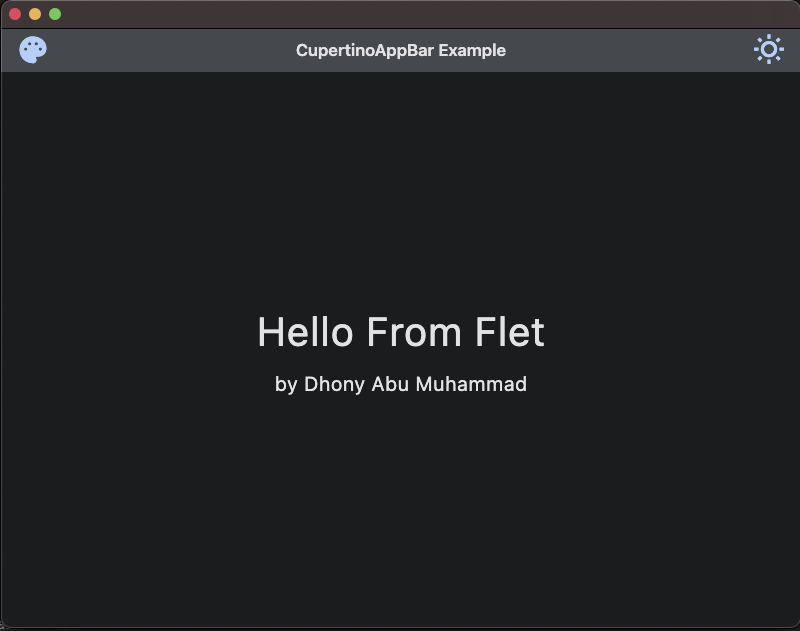
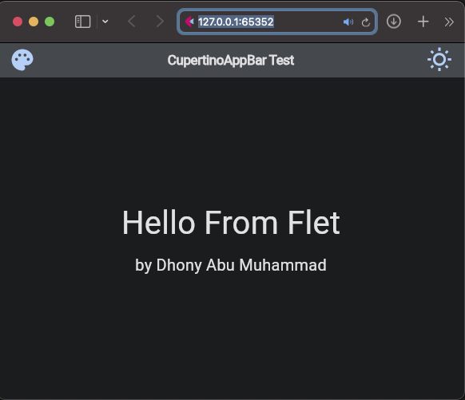

# Flet app more knowledge

### &#x1F530; Begin Project :

    ❯ pwd

        /Users/.../python-flet-app-more-knowledge

    ❯ python -m venv venv

    ❯ source ./venv/bin/activate

    ❯ pip install flet

    ❯ cd <project-name>

### &#x1FAB6; Code :

    import flet as ft

    def main(page: ft.Page):
        page.theme_mode = ft.ThemeMode.DARK
        page.vertical_alignment = ft.MainAxisAlignment.CENTER
        page.horizontal_alignment = ft.CrossAxisAlignment.CENTER

        page.appbar = ft.CupertinoAppBar(
            leading=ft.Icon(ft.icons.PALETTE),
            bgcolor=ft.colors.SURFACE_VARIANT,
            trailing=ft.Icon(ft.icons.WB_SUNNY_OUTLINED),
        middle=ft.Text("CupertinoAppBar Test"),
        )

        content_1 = ft.Container(
            content = ft.Column([
                ft.Text("Hello From Flet", size=40)
            ])
        )

        content_2 = ft.Container(
            content = ft.Column([
                ft.Text("by Dhony Abu Muhammad", size=20)
            ])
        )

        page.add(content_1, content_2)

    ft.app(target=main)

### &#x1F3C3; Run :

command for deploy desktop app

    ❯ flet main.py -d 

command for deploy web

    ❯ flet main.py -w

    

### &#x1F3C5; Result :

    

desktop apps

---

    

web

### &#x1FAA7; Notes :

    ❯ flet --version

        0.21.1
