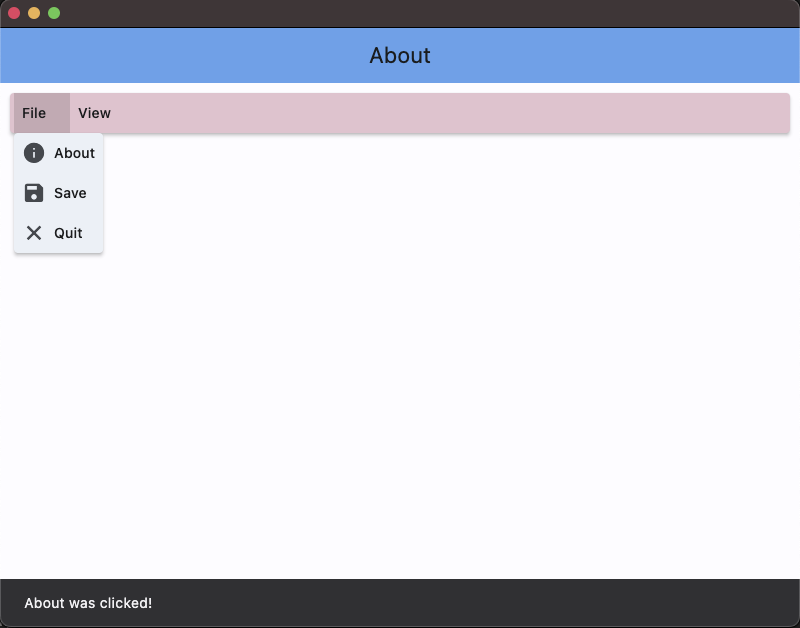

# Flet app more knowledge

### &#x1F530; Begin Project :

    ❯ pwd

        /Users/.../python-flet-app-more-knowledge

    ❯ python -m venv venv

    ❯ source ./venv/bin/activate

    ❯ pip install flet

    ❯ cd <project-name>

### &#x1FAB6; Code :

    import flet as ft

    def main(page: ft.Page):
        page.theme_mode = ft.ThemeMode.LIGHT
        appbar_text_ref = ft.Ref[ft.Text]()

        def handle_menu_item_click(e):
            print(f"{e.control.content.value}.on_click")
            page.show_snack_bar(ft.SnackBar(content=ft.Text(f"{e.control.content.value} was clicked!")))
            appbar_text_ref.current.value = e.control.content.value
            page.update()

        def handle_on_open(e):
            print(f"{e.control.content.value}.on_open")

        def handle_on_close(e):
            print(f"{e.control.content.value}.on_close")

        def handle_on_hover(e):
            print(f"{e.control.content.value}.on_hover")

        page.appbar = ft.AppBar(
            title=ft.Text("Menus", ref=appbar_text_ref),
            center_title=True,
            bgcolor=ft.colors.BLUE
        )

        menubar = ft.MenuBar(
            expand=True,
            style=ft.MenuStyle(
                alignment=ft.alignment.top_left,
                bgcolor=ft.colors.RED_100,
                mouse_cursor={ft.MaterialState.HOVERED: ft.MouseCursor.WAIT,
                            ft.MaterialState.DEFAULT: ft.MouseCursor.ZOOM_OUT},
            ),
            controls=[
                ft.SubmenuButton(
                    content=ft.Text("File"),
                    on_open=handle_on_open,
                    on_close=handle_on_close,
                    on_hover=handle_on_hover,
                    controls=[
                        ft.MenuItemButton(
                            content=ft.Text("About"),
                            leading=ft.Icon(ft.icons.INFO),
                            style=ft.ButtonStyle(bgcolor={ft.MaterialState.HOVERED: ft.colors.GREEN_100}),
                            on_click=handle_menu_item_click
                        ),
                        ft.MenuItemButton(
                            content=ft.Text("Save"),
                            leading=ft.Icon(ft.icons.SAVE),
                            style=ft.ButtonStyle(bgcolor={ft.MaterialState.HOVERED: ft.colors.GREEN_100}),
                            on_click=handle_menu_item_click
                        ),
                        ft.MenuItemButton(
                            content=ft.Text("Quit"),
                            leading=ft.Icon(ft.icons.CLOSE),
                            style=ft.ButtonStyle(bgcolor={ft.MaterialState.HOVERED: ft.colors.GREEN_100}),
                            on_click=handle_menu_item_click
                        )
                    ]
                ),
                ft.SubmenuButton(
                    content=ft.Text("View"),
                    on_open=handle_on_open,
                    on_close=handle_on_close,
                    on_hover=handle_on_hover,
                    controls=[
                        ft.SubmenuButton(
                            content=ft.Text("Zoom"),
                            controls=[
                                ft.MenuItemButton(
                                    content=ft.Text("Magnify"),
                                    leading=ft.Icon(ft.icons.ZOOM_IN),
                                    close_on_click=False,
                                    style=ft.ButtonStyle(bgcolor={ft.MaterialState.HOVERED: ft.colors.PURPLE_200}),
                                    on_click=handle_menu_item_click
                                ),
                                ft.MenuItemButton(
                                    content=ft.Text("Minify"),
                                    leading=ft.Icon(ft.icons.ZOOM_OUT),
                                    close_on_click=False,
                                    style=ft.ButtonStyle(bgcolor={ft.MaterialState.HOVERED: ft.colors.PURPLE_200}),
                                    on_click=handle_menu_item_click
                                )
                            ]
                        )
                    ]
                ),
            ]
        )

        page.add(
            ft.Row([menubar]),
        )

    ft.app(target=main, port=8888)

### &#x1F3C3; Run :

command for deploy desktop app

    ❯ flet main.py -d 

    

### &#x1F3C5; Result :

    

desktop apps

## &#x1F3C6; Application deployment with Docker container

    ❯ docker build -t flet-testapp .

    ❯ docker run -d --name flet-testapp-svc -p 8080:8888 flet-testapp

    # list

    ❯ docker images

        REPOSITORY     TAG       IMAGE ID       CREATED         SIZE
        flet-testapp   latest    4755ee642134   4 seconds ago   162MB

    ❯ docker ps -a --format "table {{.ID}}\t{{.Image}}\t{{.Status}}\t{{.Names}}\t{{.Ports}}"

        CONTAINER ID   IMAGE          STATUS          NAMES              PORTS
        2cb4dcfa9f5c   flet-testapp   Up 14 seconds   flet-testapp-svc   0.0.0.0:8080->8888/tcp 

    

web | app container

Clear all images and containers

    ❯ docker rm -f $(docker ps -aq) && docker rmi -f $(docker images -q)

        2cb4dcfa9f5c
        Untagged: flet-testapp:latest
        Deleted: sha256:4755ee64213490b249b0213bbae2194902405027075334821ca8e364b43d4fe2

---

### &#x1FAA7; Notes :

    ❯ flet --version

        0.21.1
