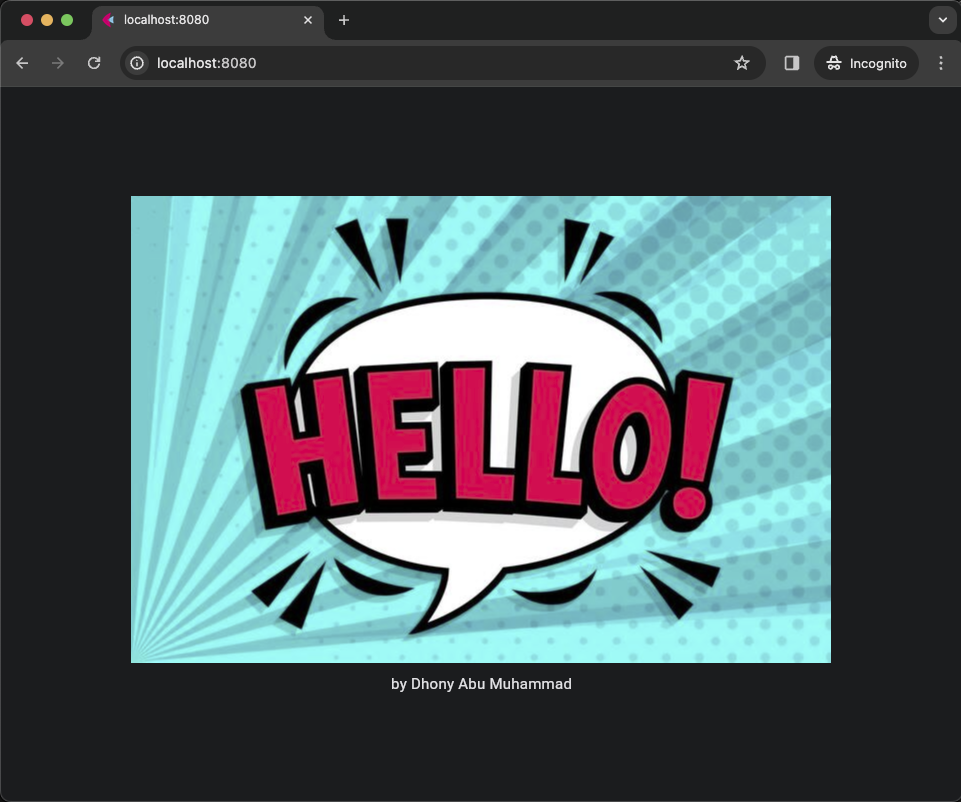

# Flet app more knowledge

### &#x1F530; Begin Project :

    ❯ pwd

        /Users/.../python-flet-app-more-knowledge

    ❯ python -m venv venv

    ❯ source ./venv/bin/activate

    ❯ pip install flet

    ❯ cd <project-name>

### &#x1FAB6; Code :

    import flet as ft

    def main(page: ft.Page):

        page.theme_mode = ft.ThemeMode.DARK
        page.vertical_alignment = ft.MainAxisAlignment.CENTER
        page.horizontal_alignment = ft.CrossAxisAlignment.CENTER

        content = ft.Container(
            content = ft.Column([
                ft.Text("by Dhony Abu Muhammad", size=15)
            ])
        )

        page.add(ft.Image(src=f"/images/helloimage.jpeg"), content)

    ft.app(
        target=main,
        assets_dir="assets", 
        port=8888
    )

### &#x1F3C3; Run :

command for deploy desktop app

    ❯ flet main.py -d 

### &#x1F3C5; Result :

    

desktop apps

---

## &#x1F3C6; Application deployment with Docker container

    ❯ docker build -t flet-testapp .

    ❯ docker run -d --name flet-testapp-svc -p 8080:8888 flet-testapp

    # list

    ❯ docker images

        REPOSITORY     TAG       IMAGE ID       CREATED          SIZE
        flet-testapp   latest    b1e101bd9847   16 seconds ago   162MB

    ❯ docker ps -a --format "table {{.ID}}\t{{.Image}}\t{{.Status}}\t{{.Names}}\t{{.Ports}}"

        CONTAINER ID   IMAGE          STATUS         NAMES              PORTS
        30de4d8a5cad   flet-testapp   Up 5 seconds   flet-testapp-svc   0.0.0.0:8080->8888/tcp

    

web | app container

Clear all images and containers

    ❯ docker rm -f $(docker ps -aq) && docker rmi -f $(docker images -q)

        30de4d8a5cad
        Untagged: flet-testapp:latest
        Deleted: sha256:b1e101bd9847db916c6625a50d35bd0f0fa6762653c093bff69021758ba1e5cc

---

### &#x1FAA7; Notes :

    ❯ flet --version

        0.21.1

    # Program structure :
    ❯ tree -L 3 -I 'gambar-petunjuk|README.md'

        ├── Dockerfile
        ├── assets
        │   └── images
        │       └── helloimage.jpeg
        └── main.py    
