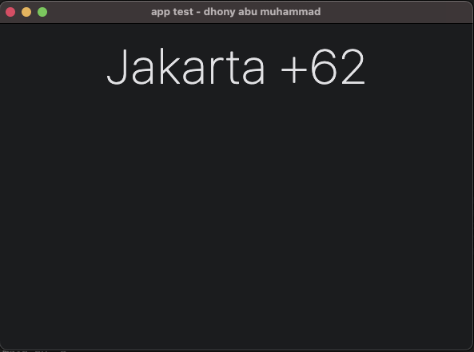

# Flet app more knowledge

### &#x1F530; Begin Project :

    ❯ pwd

        /Users/.../python-flet-app-more-knowledge

    ❯ python -m venv venv

    ❯ source ./venv/bin/activate

    ❯ pip install flet

    ❯ cd <project-name>

### &#x1FAB6; Code :

    import flet as ft

    def main(page: ft.Page):
        page.horizontal_alignment = 'CENTER'
        page.title = "app test - dhony abu muhammad"
        page.scroll = "adaptive"
        title_text = ft.Text(
            value=f"Jakarta +62",
            size=60,
            weight=ft.FontWeight.W_100,
            text_align="CENTER"
        )
        page.add(title_text)
        page.update()

    ft.app(target=main, port=8888)

### &#x1F3C3; Run :

command for deploy desktop app

    ❯ flet main.py -d 

    
### &#x1F3C5; Result :

    

desktop apps

---

### &#x1FAA7; Notes :

    ❯ flet --version

        0.21.1
