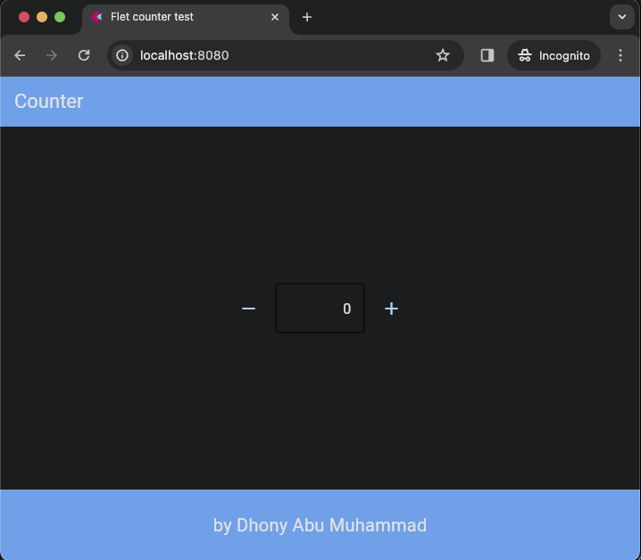

# Flet app more knowledge

### &#x1F530; Begin Project :

    ❯ pwd

        /Users/.../python-flet-app-more-knowledge

    ❯ python -m venv venv

    ❯ source ./venv/bin/activate

    ❯ pip install flet

    ❯ cd <project-name>

### &#x1FAB6; Code :

    import flet as ft

    def main(page: ft.Page):
        page.title = "Flet counter test"
        page.vertical_alignment = ft.MainAxisAlignment.CENTER

        page.appbar = ft.AppBar(
            title=ft.Text("Counter"),
            center_title=False,
            bgcolor=ft.colors.BLUE,
            automatically_imply_leading=False,
        )

        page.bottom_appbar = ft.BottomAppBar(
            bgcolor=ft.colors.BLUE,
            content=ft.Row(
                controls=[
                    ft.Container(expand=True),
                    ft.Text("by Dhony Abu Muhammad", size=20),
                    ft.Container(expand=True),
                ]
            ),        
        )

        txt_number = ft.TextField(value="0", text_align=ft.TextAlign.RIGHT, width=100)

        def minus_click(e):
            txt_number.value = str(int(txt_number.value) - 1)
            page.update()

        def plus_click(e):
            txt_number.value = str(int(txt_number.value) + 1)
            page.update()

        page.add(
            ft.Row(
                [
                    ft.IconButton(ft.icons.REMOVE, on_click=minus_click),
                    txt_number,
                    ft.IconButton(ft.icons.ADD, on_click=plus_click),
                ],
                alignment=ft.MainAxisAlignment.CENTER,
            )
        )

    ft.app(target=main,port=8888)

### &#x1F3C3; Run :

command for deploy desktop app

    ❯ flet main.py -d 

    

### &#x1F3C5; Result :

    

desktop apps

---

## &#x1F3C6; Application deployment with Docker container

    ❯ docker build -t flet-testapp .

    ❯ docker run -d --name flet-testapp-svc -p 8080:8888 flet-testapp

    # list

    ❯ docker images

        REPOSITORY     TAG       IMAGE ID       CREATED         SIZE
        flet-testapp   latest    a03f5c4aa9a8   8 seconds ago   161MB

    ❯ docker ps -a --format "table {{.ID}}\t{{.Image}}\t{{.Status}}\t{{.Names}}\t{{.Ports}}"

        CONTAINER ID   IMAGE          STATUS              NAMES              PORTS
        e76b5fe43622   flet-testapp   Up About a minute   flet-testapp-svc   0.0.0.0:8080->8888/tcp

    

web | app container

Clear all images and containers

    ❯ docker rm -f $(docker ps -aq) && docker rmi -f $(docker images -q)

        e76b5fe43622
        Untagged: flet-testapp:latest
        Deleted: sha256:a03f5c4aa9a80fa5f22c92684e673f1616a79c6be29158f7b73e03517abb3bdb

---

### &#x1FAA7; Notes :

    ❯ flet --version

        0.21.1
